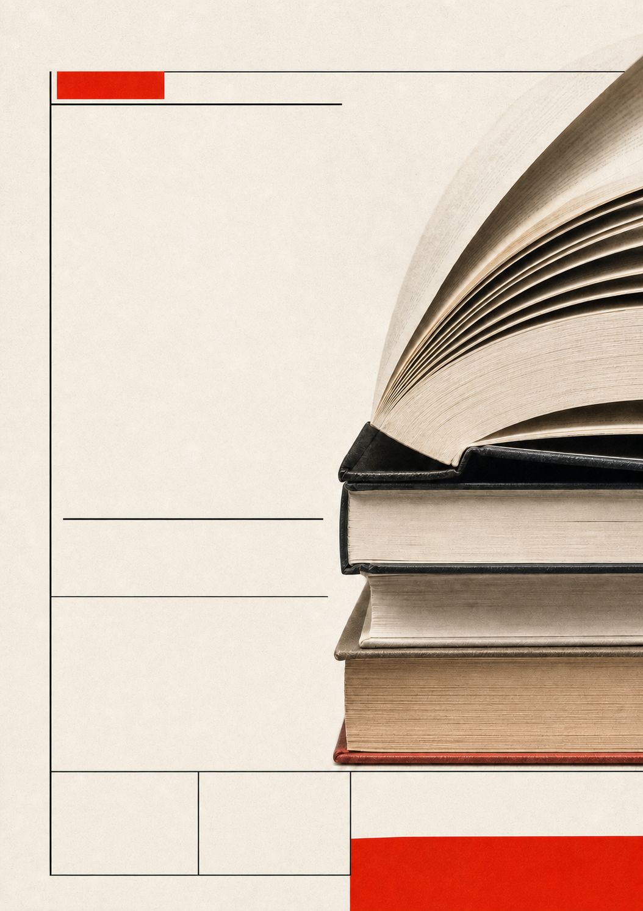

# A4 Poster Skill

一個用於 Codex 與 Claude Code 的通用 A4 海報設計技能。適用於活動、文化、教育、宣傳、服務、安全提醒與其他主題，不綁定醫療或公部門。

核心做法不是先做空背景，而是：

1. 用圖片生成功能產出含圖片、文字、裝飾與完整排版的海報概念。
2. 以 1:1 裁切逐塊檢字，判定哪些生成文字「保留」、哪些「重排」。
3. 核准設計後，把同一母稿升級到印刷尺寸。
4. 只原位移除要重排的文字，保留構圖、圖片、面板、紋理、裝飾與保留字。
5. 用經驗證的系統字型重建其餘正式文字。
6. 檢查尺寸、DPI、字型解析、glyph coverage、溢出與實際像素。

字級大、造型特殊又完全正確的標題字，本身就是設計的一部分。把它去掉再用系統字補回來只會弄壞畫面，所以流程改成先檢字再決定去哪些字；小字、內文、電話、頁尾則一律重排，避免糊掉或亂碼。

## 主要能力

- 支援只有主題、已有文案、舊海報重排、參考圖與品牌素材等入口。
- 三個確認點：需求與文案、完整海報概念（含保留／重排判定）、正式排版成品。
- 六種以設計語言分類的通用海報風格。
- `crop_text_regions.ps1` 以最近鄰放大切出 1:1 文字裁切圖，可依 config、指定座標或整張網格掃描，糊的字放大後仍然是糊的，不會被誤判成乾淨。
- HTML 排版畫布：文字方框可拖曳移動、右下角可拉大小、溢出標紅、id 標籤、量測模式（框選面板內緣後一鍵套用成方框座標）、概念圖疊圖與差異模式、一鍵複製 JSON。
- renderer 使用 `GenericTypographic` 量測與繪製，避免預設 GDI+ padding 造成誤判。
- 字型檢查會報告 `requested -> resolved`，支援英文字型別名解析成在地化名稱，也會擋下不存在的字型、不可用 style 與缺字 fallback。
- 中文禁則與視距字級會在 render 前檢查。
- verifier 會取樣無字背景，檢查文字區 10th-percentile 對比並提示高雜訊背景。
- 預設輸出 A4 直式 `2480 × 3508`、`300 DPI` PNG。

## 製作流程示範

以下是同一張虛構「城市週末書市」海報的實際流程：先生成完整概念，再從同一母稿去字，最後用 renderer 加回精準文字。

<table>
  <tr>
    <td align="center"><strong>1. 完整概念</strong><br><a href="assets/workflow-demo/swiss-grid-concept.png"></a></td>
    <td align="center"><strong>2. 原位去字</strong><br><a href="assets/workflow-demo/swiss-grid-cleaned.png"></a></td>
    <td align="center"><strong>3. 系統字定稿</strong><br><a href="assets/style-previews/swiss-grid.jpg"></a></td>
  </tr>
</table>

## 通用海報設計風格

- `swiss-grid`：瑞士網格
- `bold-geometric`：大膽幾何
- `editorial-collage`：編輯拼貼
- `soft-illustrative`：柔和插畫
- `retro-modern`：復古現代
- `photographic-poster`：攝影主導

所有預覽都使用同一份虛構活動內容，並由正式 renderer 套用已驗證的本機字型。完整規格見 `references/preset-styles.md`。

<table>
  <tr>
    <td align="center"><strong>swiss-grid｜瑞士網格</strong><br><a href="assets/style-previews/swiss-grid.jpg"></a></td>
    <td align="center"><strong>bold-geometric｜大膽幾何</strong><br><a href="assets/style-previews/bold-geometric.jpg"></a></td>
  </tr>
  <tr>
    <td align="center"><strong>editorial-collage｜編輯拼貼</strong><br><a href="assets/style-previews/editorial-collage.jpg"></a></td>
    <td align="center"><strong>soft-illustrative｜柔和插畫</strong><br><a href="assets/style-previews/soft-illustrative.jpg"></a></td>
  </tr>
  <tr>
    <td align="center"><strong>retro-modern｜復古現代</strong><br><a href="assets/style-previews/retro-modern.jpg"></a></td>
    <td align="center"><strong>photographic-poster｜攝影主導</strong><br><a href="assets/style-previews/photographic-poster.jpg"></a></td>
  </tr>
</table>

## 安裝

Codex：

```powershell
git clone https://github.com/ayase0307/a4-notice-poster-skill.git "$env:USERPROFILE\.codex\skills\a4-notice-poster"
```

Claude Code：

```powershell
git clone https://github.com/ayase0307/a4-notice-poster-skill.git "$env:USERPROFILE\.claude\skills\a4-notice-poster"
```

重新開啟應用程式後，描述 A4 海報需求或明確指定 `$a4-notice-poster`。

## 可執行範例與 smoke test

repo 內附可直接執行的背景、config 與測試：

```powershell
./scripts/render_a4_poster.ps1 -ConfigPath ./examples/smoke/poster-config.json
./scripts/verify_poster.ps1 -ImagePath ./examples/smoke/output/poster.png -ConfigPath ./examples/smoke/poster-config.json -ReportPath ./examples/smoke/output/verification-report.json
./examples/smoke/smoke_test.ps1
```

`smoke_test.ps1` 會驗證：

- 成功輸出 `2480 × 3508`、`300 DPI` PNG，且 JPG 預覽保留 `300 DPI` metadata；
- `Microsoft JhengHei` 可正確解析成在地化 family，HTML 畫布也保留 config 內的英文字型別名；
- 文字溢出會被擋下；
- 不存在的字型不會靜默 fallback。
- 中文禁則錯誤會被擋下；
- `1 m`、`3 m`、`5 m` 的標題與內文字級下限符合對照表，低於下限時會被擋下；
- 低對比案例只因 `ContrastPass` 失敗而被擋下；
- 高背景雜訊會留下警告，但不會單獨讓整張海報失敗。

`-ReportPath` 會在 verifier 丟出失敗前寫出 JSON，方便 CI 與回歸測試確認真正失敗的欄位。

## 執行需求

- Windows PowerShell 或 PowerShell 7
- `System.Drawing`
- 已安裝的中文字型
- 可用的圖片生成功能

含中文字面量的 `.ps1` 必須存成 **UTF-8 with BOM**。Windows PowerShell 5.1 沒有 BOM 就會用 ANSI 讀取，`layout_checks.ps1` 會整支解析失敗、中文禁則檢查靜默失效，畫布的中文介面也會變亂碼。編輯這些檔案時請保留 BOM。

## 印刷適用範圍

預設成品是 RGB、無出血的 A4 PNG，適合一般辦公室、院所、店面或家用印表機。送專業印刷廠前，請依印刷廠規格另外處理 CMYK、ICC profile、出血、裁切線與 PDF；本 repo 不宣稱已完成這些印前條件。

## 相容性提醒

renderer 現在以 `GenericTypographic` 量測並逐行繪製文字。舊版 config 若依賴 GDI+ 預設 padding 或 line gap，升級後垂直位置可能略有差異，應重新檢查正式 PNG，而不是沿用舊座標直接交付。

## License

MIT
